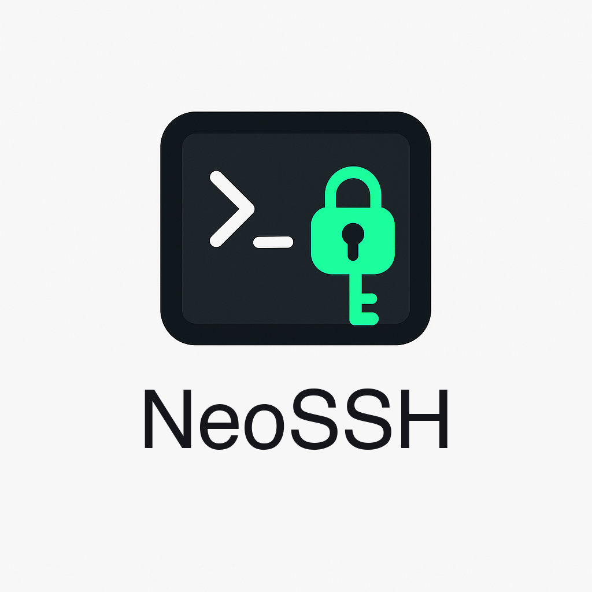

<div align="center"></div>

<div align="center">


</div>

## Description

A terminal-based SSH manager inspired by lazydocker and k9s — built for managing your fleet of servers directly from your terminal.

## About This Fork

This is a maintained fork of [Adembc/lazyssh](https://github.com/Adembc/lazyssh), which hasn't seen active maintenance. This fork integrates community PRs and continues development.

## Screenshots

<details>
<summary>📷 Screenshots</summary>

### Startup


### Server List


### Fuzzy Search


### SSH Connection


### Add Server


</details>

## ✨ Features

### Server Management
- 📜 Read & display servers from your `~/.ssh/config` in a scrollable list.
- ➕ Add a new server from the UI with comprehensive SSH configuration options.
- ✏ Edit existing server entries directly from the UI with a tabbed interface.
- 🗑 Delete server entries safely.
- 📌 Pin / unpin servers to keep favorites at the top.
- 🏓 Ping server to check status.

### Quick Server Navigation
- 🔍 Fuzzy search by alias, IP, or tags.
- 🖥 One‑keypress SSH into the selected server (Enter).
- 🏷 Tag servers (e.g., prod, dev, test) for quick filtering.
- ↕️ Sort by alias or last SSH (toggle + reverse).

### Advanced SSH Configuration
- 🔗 Port forwarding (LocalForward, RemoteForward, DynamicForward).
- 🚀 Connection multiplexing for faster subsequent connections.
- 🔐 Advanced authentication options (public key, password, agent forwarding).
- 🔒 Security settings (ciphers, MACs, key exchange algorithms).
- 🌐 Proxy settings (ProxyJump, ProxyCommand).
- ⚙️ Extensive SSH config options organized in tabbed interface.

### Key Management
- 🔑 SSH key autocomplete with automatic detection of available keys.
- 📝 Smart key selection with support for multiple keys.

### New in v0.4.0
- 📋 Copy SSH command shortcut to clipboard.
- 💾 Sort mode persisted across restarts.
- 🗂 `--sshconfig <path>` flag to use a custom SSH config file.
- 📂 XDG Base Directory support (`$XDG_CONFIG_HOME` / `$XDG_STATE_HOME`).
- 📂 Full `Include` directive support in `~/.ssh/config`.
- 🔢 Numeric shortcuts (`1/2/3`) to jump focus between panels.

## Installation

### Homebrew (macOS & Linux)
```bash
brew install WhiteRoseLK/tap/lazyssh
```

### Go Install
```bash
go install github.com/WhiteRoseLK/lazyssh/cmd@latest
```

### Binary Releases
Pre-compiled binaries are available on the [releases page](https://github.com/WhiteRoseLK/lazyssh/releases).

## Usage

```bash
lazyssh
```
Optional flags: `--sshconfig <path>` to use a custom SSH config file.

## Keybindings

| Key | Action |
|-----|--------|
| `Enter` | SSH into selected server |
| `/` | Fuzzy search |
| `a` | Add server |
| `e` | Edit server |
| `d` | Delete server |
| `p` | Pin/unpin server |
| `t` | Edit tags |
| `c` | Copy SSH command |
| `s` | Toggle sort mode |
| `P` | Ping server |
| `1/2/3` | Jump focus between panels |
| `j/k` | Navigate up/down |
| `q` / `Ctrl+C` | Quit |

## 🔐 Security Notice

lazyssh does not introduce any new security risks.
It is simply a UI/TUI wrapper around your existing `~/.ssh/config` file.

- All SSH connections are executed through your system's native ssh binary (OpenSSH).
- Private keys, passwords, and credentials are never stored, transmitted, or modified by lazyssh.
- Your existing IdentityFile paths and ssh-agent integrations work exactly as before.
- lazyssh only reads and updates your `~/.ssh/config`. A backup of the file is created automatically before any changes.
- File permissions on your SSH config are preserved to ensure security.

## 🛡️ Config Safety: Non‑destructive writes and backups

- **Non‑destructive edits**: lazyssh only writes the minimal required changes to your `~/.ssh/config`. It uses a parser that preserves existing comments, spacing, order, and any settings it didn't touch. Your handcrafted comments and formatting remain intact.
- **Atomic writes**: updates are written to a temporary file and then atomically renamed over the original, minimizing the risk of partial writes.
- **Backups**:
  - *One‑time original backup*: before lazyssh makes its first change, it creates a single snapshot named `config.original.backup` beside your SSH config. If this file is present, it will never be recreated or overwritten.
  - *Rolling backups*: on every subsequent save, lazyssh also creates a timestamped backup named like: `~/.ssh/config-<timestamp>-lazyssh.backup`. The app keeps at most 10 of these backups, automatically removing the oldest ones.

## 📂 SSH Config `Include` Support

lazyssh honours top-level `Include` directives in your `~/.ssh/config`. Hosts defined in included files (e.g. `~/.ssh/config.d/work`) appear in the server list alongside hosts defined in the main config.

- **Reads:** all `Include`d files are parsed in OpenSSH precedence order. When the same alias is defined in more than one file, the first definition wins (matching OpenSSH semantics) but every source file is recorded so the UI can prompt on edit.
- **Writes route back to the source file:** editing or deleting a host modifies whichever file actually defines it. Other files are never touched, and only the file that changed is re-serialized — preserving handcrafted formatting elsewhere.
- **Ambiguity prompt:** if the same alias is defined in multiple included files, the first edit/delete shows a modal asking which file to write to. Your choice is remembered in `~/.lazyssh/metadata.json` (per-alias `file` field), so subsequent edits go straight through without re-prompt.

## Contributing

Contributions are welcome! Please feel free to submit a Pull Request or open an [Issue](https://github.com/WhiteRoseLK/lazyssh/issues).

## License

This project is licensed under the [Apache-2.0 License](LICENSE). Originally created by [Adembc](https://github.com/Adembc).

## Acknowledgments

Thanks to Adembc for creating the original lazyssh project, and to all community contributors for their patches and improvements.
