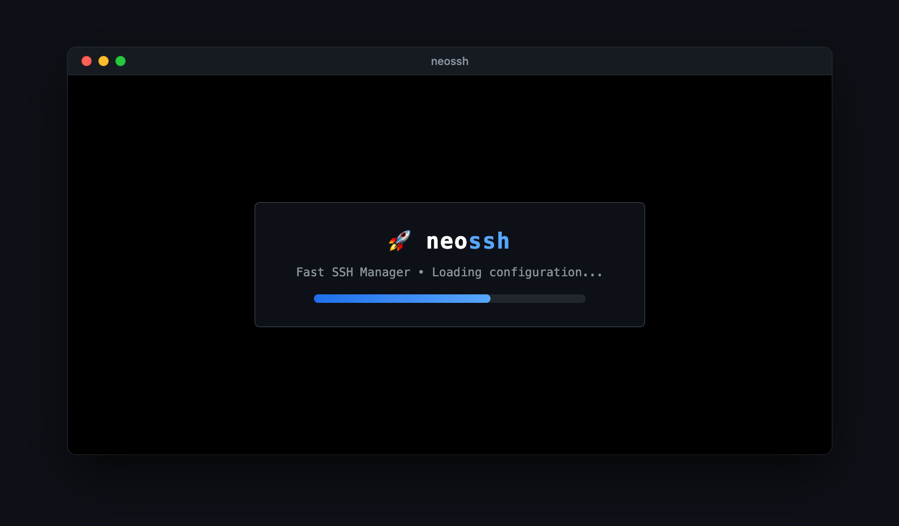
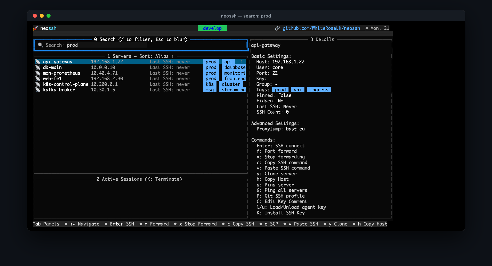
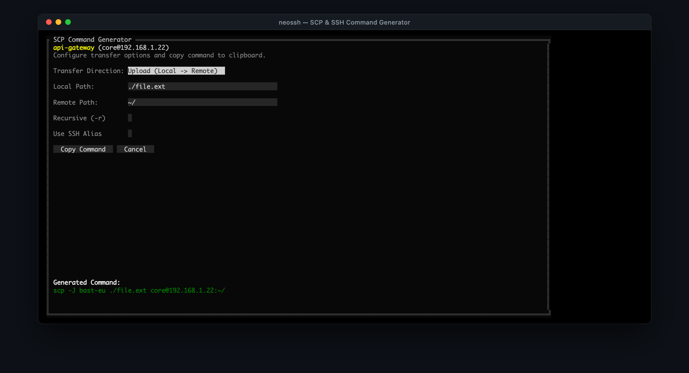

<div align="center">
  <h1>🚀 neossh</h1>
  <p><b>An actively maintained fork and continuation of <a href="https://github.com/Adembc/lazyssh">lazyssh</a></b></p>
  <p><i>Created by <a href="https://github.com/Adembc">Adembc</a> • Maintained & developed by <a href="https://github.com/WhiteRoseLK">WhiteRoseLK</a> & the community</i></p>
</div>

<div align="center">

[](https://github.com/WhiteRoseLK/neossh/releases)
[](LICENSE)
[](go.mod)
[](https://github.com/Adembc/lazyssh)

</div>

---

> [!NOTE]
> **neossh is a direct fork of [lazyssh](https://github.com/Adembc/lazyssh)**, originally created by [Adembc](https://github.com/Adembc).
> All core credit for the foundational idea, design, and original implementation belongs to **Adembc**.
> This project exists solely because the original repository became unmaintained while having numerous valuable open PRs and issues. Rather than letting that work gather dust, **neossh** continues development, integrates community contributions, and provides ongoing maintenance.

## 💡 About neossh

**neossh** is an interactive, keyboard-driven SSH manager for your terminal. With neossh, you can quickly navigate, connect, manage, and configure servers defined in your `~/.ssh/config` without remembering IP addresses or dealing with complex SSH commands.

### Why neossh?

The original [lazyssh](https://github.com/Adembc/lazyssh) repository had not seen merged changes in over a year despite dozens of open issues and a great backlog of community-contributed pull requests. `neossh` was born to pick up the torch and give these contributions a home:
- 🔄 **Community PRs integrated**: Full SSH `Include` support, fuzzy search, XDG directory compliance, custom config flags, and critical UI/navigation bug fixes.
- ⚡ **Zero friction migration**: `neossh` automatically detects and migrates your existing favorites, connection history, and tags from `~/.lazyssh` to `~/.neossh`.
- 🛠️ **Active stewardship**: Regular releases, responsive issue triage, and continuous bug fixes.

---

## 📷 Screenshots

<details>
<summary>Click to expand screenshots</summary>

### Startup


### Server List


### Fuzzy Search


### SSH Connection


### Add Server


</details>

---

## ✨ Features

### Server Management
- 📜 Read & display servers from your `~/.ssh/config` in a clean, scrollable list.
- ➕ Add a new server from the UI with comprehensive SSH configuration options.
- ✏ Edit existing server entries directly from the UI with a tabbed interface.
- 🗑 Delete server entries safely.
- 📌 Pin / unpin servers to keep favorites at the top.
- 🏓 Ping server to check reachability.

### Quick Server Navigation
- 🔍 Fuzzy search by alias, IP, or tags (`/`).
- 🖥 One‑keypress SSH into the selected server (`Enter`).
- 🏷 Tag servers (e.g., `prod`, `dev`, `test`) for quick filtering.
- ↕️ Sort by alias or last SSH (toggle + reverse).
- 🔢 Jump focus between panels using numeric shortcuts (`1`, `2`, `3`).

### Advanced SSH Configuration
- 🔗 Port forwarding (`LocalForward`, `RemoteForward`, `DynamicForward`).
- 🚀 Connection multiplexing for instant subsequent connections.
- 🔐 Advanced authentication options (public key, password, agent forwarding).
- 🔒 Security settings (ciphers, MACs, key exchange algorithms).
- 🌐 Proxy settings (`ProxyJump`, `ProxyCommand`).
- ⚙️ Full SSH config options organized in a tabbed interface.

### Key Management
- 🔑 SSH key autocomplete with automatic detection of available keys in `~/.ssh/`.
- 📝 Smart key selection with support for multiple identity files.

### Enhancements over lazyssh
- 📂 **Full `Include` directive support**: Hosts defined in included files (e.g. `~/.ssh/config.d/*`) appear seamlessly, and writes safely route back to the original source file.
- 📋 **Copy SSH command**: Copy the full SSH command to clipboard with a single key (`c`).
- 💾 **Persistent sort mode**: Your preferred sort order is remembered across sessions.
- 🗂 **Custom SSH config**: `--sshconfig <path>` flag to target any configuration file.
- 📦 **XDG Base Directory compliant**: Respects `$XDG_CONFIG_HOME` and `$XDG_STATE_HOME`.

---

## 🚀 Installation

### Option 1: Homebrew (macOS & Linux) — Official Tap

Install `neossh` using the official Homebrew tap:

```bash
brew tap WhiteRoseLK/tap
brew trust WhiteRoseLK/tap
brew install neossh
```

*(If you previously had `lazyssh` installed, Homebrew will seamlessly prompt to replace it while preserving your server configs and metadata).*

> [!NOTE]
> **Why an external tap instead of `brew install neossh` directly?**  
> Homebrew Core requires new packages to meet a community adoption threshold (typically 50–75 GitHub stars) before being accepted into the central registry.
> 
> Because `neossh` was recently established as an independent continuation of `lazyssh`, it is currently distributed via this official tap. Once the project meets Homebrew's notoriety criteria, we will submit a formula to `homebrew/core` so everyone can simply run `brew install neossh`.
> 
> ⭐ **[Star the repository](https://github.com/WhiteRoseLK/neossh)** to help us reach the threshold for Homebrew Core inclusion!

---

### Option 2: Pre-compiled Binaries (Direct Download)

Ready-to-run binaries are available for **macOS**, **Linux**, and **Windows** on the [Releases page](https://github.com/WhiteRoseLK/neossh/releases/latest).

#### One-liner for macOS & Linux:

```bash
# Automatically downloads and extracts the latest binary for your OS and architecture:
OS="$(uname -s)"
ARCH="$(uname -m)"
[ "$ARCH" = "x86_64" ] && ARCH="x86_64" || ARCH="arm64"

curl -sL "https://github.com/WhiteRoseLK/neossh/releases/latest/download/neossh_${OS}_${ARCH}.tar.gz" | tar -xz

# Move binary to PATH:
sudo mv neossh /usr/local/bin/
```

#### Windows:
1. Download the `.zip` archive from the [Releases page](https://github.com/WhiteRoseLK/neossh/releases/latest).
2. Extract `neossh.exe` to a folder in your `PATH` (e.g. `C:\Windows\System32` or a dedicated tools directory).

---

### Option 3: Go Install

If you have Go installed:

```bash
go install github.com/WhiteRoseLK/neossh/cmd@latest
```

*(Make sure `$GOPATH/bin` or `~/go/bin` is in your `$PATH`).*

---

### Option 4: Build from Source

**Prerequisites**: [Go](https://go.dev/) 1.22+ and `git` (and optionally `make`).

```bash
# 1. Clone the repository
git clone https://github.com/WhiteRoseLK/neossh.git
cd neossh

# 2. Build using Make
make build

# 3. Install the binary into your PATH
sudo cp bin/neossh /usr/local/bin/
```

*Or build manually without Make:*

```bash
go build -ldflags "-X main.version=v1.0.0" -o neossh ./cmd/main.go
sudo mv neossh /usr/local/bin/
```

---

## ⌨️ Keybindings

| Key | Action |
|:---:|--------|
| `Enter` | SSH into selected server |
| `/` | Fuzzy search by alias, IP, or tag |
| `a` | Add new server |
| `e` | Edit selected server |
| `d` | Delete selected server |
| `p` | Pin / unpin server |
| `t` | Edit tags |
| `c` | Copy SSH connection command to clipboard |
| `K` | Push SSH public key to server via `ssh-copy-id` |
| `s` | Toggle sort mode (alias, last SSH, reverse) |
| `P` | Ping selected server |
| `1` / `2` / `3` | Focus Search / Server List / Details |
| `j` / `k` or `↓` / `↑` | Navigate server list |
| `q` / `Ctrl+C` | Quit |

---

## 🔐 Security Notice

`neossh` does not introduce any new security risks. It is a TUI wrapper around your existing `~/.ssh/config` file:

- All SSH connections are executed through your system's native `ssh` binary (OpenSSH).
- Private keys, passwords, and credentials are never stored, transmitted, or inspected by `neossh`.
- Your existing `IdentityFile` paths and `ssh-agent` integrations work exactly as before.
- File permissions on your SSH config (`0600`) are strictly preserved.

---

## 🛡️ Config Safety: Non‑destructive writes and backups

- **Non‑destructive edits**: `neossh` only writes the minimal required changes to your `~/.ssh/config`. Comments, spacing, indentation, and untouched settings remain intact.
- **Atomic writes**: Updates are written to a temporary file and atomically renamed over the original to prevent corruption.
- **Backups**:
  - *One‑time snapshot*: Before `neossh` makes its first change, it creates a snapshot named `config.original.backup`. This file is never overwritten.
  - *Rolling backups*: On each save, `neossh` creates a timestamped backup (`~/.ssh/config-<timestamp>-neossh.backup`), keeping the 10 most recent.

---

## 📂 SSH Config `Include` Support

`neossh` honours top-level `Include` directives in your `~/.ssh/config`:

- **Reads**: All included files are parsed in OpenSSH precedence order.
- **Writes route back to source**: Editing or deleting a host modifies the file that actually defines it. Other files are never touched.
- **Ambiguity modal**: If the same alias is defined in multiple files, a prompt asks which file to update. Your choice is remembered in `metadata.json`.

---

## 🤝 Contributing

Contributions are welcome! Feel free to open an [Issue](https://github.com/WhiteRoseLK/neossh/issues) or submit a Pull Request.

---

## 📄 License & Attribution

This project is licensed under the [Apache-2.0 License](LICENSE).

### Credits & Acknowledgments

- **[Adembc](https://github.com/Adembc)**: Original author and creator of [lazyssh](https://github.com/Adembc/lazyssh). Without his architectural work, `neossh` would not exist.
- **Community contributors**: Full credit to all contributors from the upstream repository whose ideas and pull requests made this release possible:
  - `@DelphicOkami`, `@malaiwah`, `@aabichou`, `@barthofu` — SSH `Include` support
  - `@omani` — `--sshconfig` custom config flag
  - `@gonsalvesc` — XDG base directory specification support
  - `@levinion` — Copy SSH command shortcut
  - `@gaoyifan` — Persistent sort mode
  - `@k161196` — Panel focus shortcuts
  - `@arniom`, `@leoncamel`, `@breakersun`, `@OlalalalaO`, `@manato-tajiri`, `@komapro` — Bug fixes & documentation improvements
